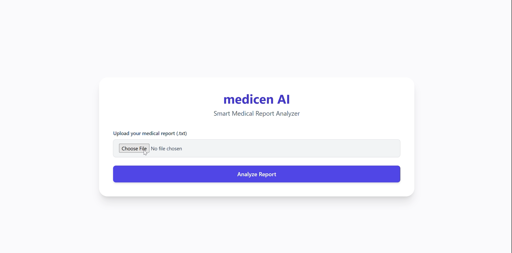

# Medican AI - Smart Medical Report Analyzer

MediScan AI is a web-based application that analyzes medical reports using specialized AI agents (Cardiologist, Psychologist, and Pulmonologist) and provides a comprehensive multidisciplinary diagnosis.

## Features

- **Specialist Analysis**: Three specialized AI agents analyze reports from different perspectives
  - Cardiologist: Focuses on cardiac health
  - Psychologist: Evaluates mental health aspects
  - Pulmonologist: Assesses respiratory conditions
- **Multidisciplinary Integration**: Combines insights from all specialists for comprehensive diagnosis
- **Simple Interface**: Easy-to-use web interface for uploading reports and viewing results
- **Fast Processing**: Concurrent processing of specialist analyses for quick results

## Technology Stack

- **Backend**: Python with Flask
- **AI Framework**: LangChain with Groq API (Llama 3 70B model)
- **Frontend**: HTML5 with Tailwind CSS
- **Concurrency**: ThreadPoolExecutor for parallel specialist analysis

## Installation

### Prerequisites

- Python 3.8+
- Groq API key (get from [Groq Cloud](https://console.groq.com/))
- pip package manager

## 🔗 Additional Resources
- **linkden**: [Karim Farjam's Profile](https://www.linkedin.com/in/karim-farjam-a6b72549/).
- **Kaggle Notebook**: Interested in a Kaggle environment? Check out the notebook [here](https://www.kaggle.com/parhamfarjam).
- **LinkedIn**: [Karim Farjam's Profile](https://www.linkedin.com/in/karim-farjam-a6b72549/)
